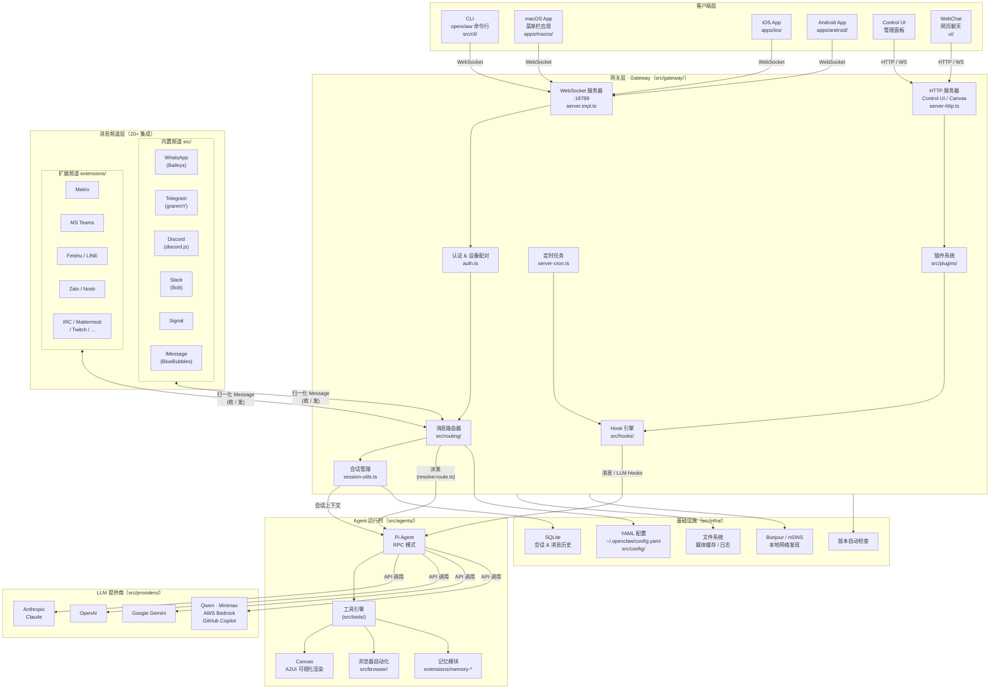
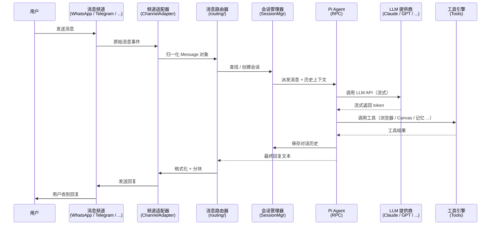

# OpenClaw 架构图

## 系统总览



## 消息处理流程



## 频道适配器接口

每个频道插件通过实现以下适配器接口与核心解耦：

| 适配器 | 职责 |
|--------|------|
| `ChannelMessagingAdapter` | 发 / 收消息，输入提示 |
| `ChannelAuthAdapter` | 登录（QR / Email）、退出、Token 刷新 |
| `ChannelOutboundAdapter` | 格式化并发送回复 |
| `ChannelGroupAdapter` | 群组消息处理 |
| `ChannelThreadingAdapter` | 线程 / 回复处理 |
| `ChannelSecurityAdapter` | DM 策略、白名单执行 |
| `ChannelStatusAdapter` | 健康检查、连接状态 |
| `ChannelPairingAdapter` | 设备 / 账号配对 UI |
| `ChannelCommandAdapter` | 频道特定命令 |

## 插件 & Hook 系统

```
插件发现
└── node_modules/@openclaw/*   (npm 插件)
└── extensions/*               (工作区插件)
└── ~/.openclaw/plugins/       (用户自定义插件)

Hook 阶段
├── gateway.*    网关启动 / 关闭
├── message.*    消息预处理
├── llm.*        LLM 调用（模型覆盖 / 提示变换）
├── session.*    会话生命周期
├── tool.*       工具调用
└── subagent.*   子 Agent 生成
```

## 目录结构速查

```
openclaw/
├── src/
│   ├── cli/          CLI 入口 & 解析器
│   ├── commands/     命令实现 (gateway, agent, send, onboard ...)
│   ├── gateway/      WebSocket 控制平面（核心）
│   ├── channels/     频道抽象层 & 适配器接口
│   ├── routing/      消息路由逻辑
│   ├── agents/       Agent 运行时 & 工作区
│   ├── plugins/      插件发现 & 注册
│   ├── hooks/        内置 Hook（Gmail、消息拦截 ...）
│   ├── providers/    LLM 提供商认证
│   ├── config/       配置加载 & 校验（Zod）
│   ├── infra/        基础设施工具
│   ├── media/        媒体处理（图片 / 音视频）
│   ├── sessions/     会话持久化
│   └── web/          WebChat 后端
├── extensions/       频道 & 功能插件（42 个）
├── apps/
│   ├── ios/          Swift / SwiftUI
│   ├── android/      Kotlin / Gradle
│   └── macos/        Swift / SwiftUI 菜单栏
├── ui/               Control UI & WebChat 前端
└── docs/             文档（Mintlify）
```
